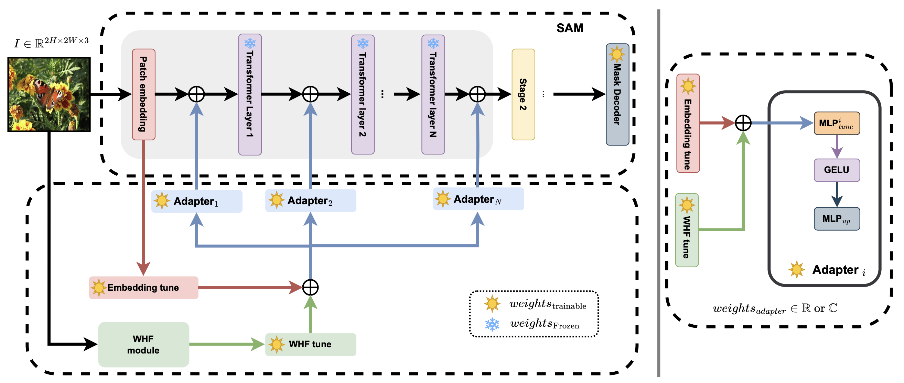

<!-- # SAMWave - Official Pytorch Implementation (BMVC 2025) -->
<div align="center">
<h1>Official Pytorch Implementation of SAMWave: 

Adapting Segment Anything Model to Difficult Tasks </h1>
Saurabh Yadav*, Avi Gupta*, Koteswar Rao Jerripothula<br />
Indraprastha Institute of Information Technology, Delhi, India</sub><br />
Indian Institute of Technology, Kanpur, India</sub><br />

[](https://bmva-archive.org.uk/bmvc/2025/assets/papers/Paper_698/paper.pdf)
[](https://arxiv.org/abs/2507.20186)<br />

<!--[]() -->


</div>

## Abtract
The emergence of large vision models has propelled significant advances in various
domains. The Segment Anything Model (SAM), a leading model for image segmentation, exemplifies these advances, outperforming traditional methods. However, such
foundation models often suffer from performance degradation when applied to complex
tasks for which they are not trained. Existing methods typically employ adapter-based
fine-tuning strategies to adapt SAM for difficult tasks and leverage high-frequency features extracted from the Fourier domain. However, our analysis reveals that these approaches offer limited benefits due to constraints in their feature extraction techniques.
To overcome this, we propose SAMWave, a novel and interpretable approach that utilizes the wavelet transform to extract richer, multi-scale high-frequency features from
input data. Extending this, we introduce complex-valued adapters capable of capturing
complex-valued information via complex wavelet transforms. By adaptively integrating
these wavelet coefficients, SAMWave enables SAM’s encoder to capture more relevant
information for dense prediction. Empirical evaluations on four difficult vision tasks
demonstrate that SAMWave significantly outperforms existing adaptation methods. This
superior performance is consistent across both the SAM and SAM2 backbones and holds
for both real and complex-valued adapter variants, highlighting the efficiency, flexibility,
and interpretability of our proposed method for adapting segment anything models. 

## Preparation

### Requirements
Environment settings:
```
pip install -r requirements.txt
```

### Datasets

Will be updated soon.

### Pre-trained Models
Will be updated soon.

### Training
Will be updated soon.

### Testing
Will be updated soon.

## Citation
If you find the repository or the paper useful, please use the following entry for citation.
````BibTeX
@inproceedings{Yadav_2025_BMVC,
author    = {Saurabh Yadav and Avi Gupta and Koteswar Rao Jerripothula},
title     = {SAMWave: Adapting Segment Anything Model to difficult tasks},
booktitle = {36th British Machine Vision Conference 2025, {BMVC} 2025, Sheffield, UK, November 24-27, 2025},
publisher = {BMVA},
year      = {2025},
url       = {https://bmva-archive.org.uk/bmvc/2025/assets/papers/Paper_698/paper.pdf}
}
````
## Contributors and Contact
We would like to thank [SAM-Adapter](https://github.com/tianrun-chen/SAM-Adapter-PyTorch) for their help in building this repository. If there are any questions, feel free to contact the authors: Saurabh Yadav (saurabhy@iiitd.ac.in), Avi Gupta (avig@iiitd.ac.in).